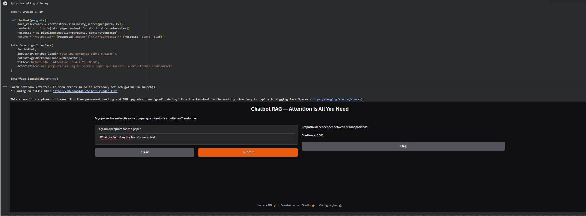
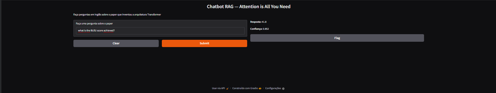
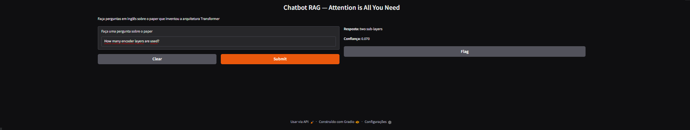
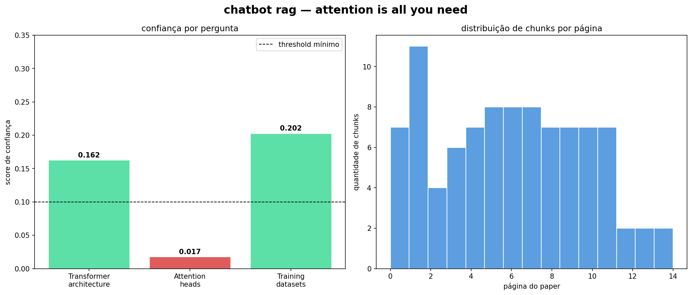

# 🤖 Chatbot RAG — Retrieval Augmented Generation

Chatbot que responde perguntas sobre qualquer documento PDF usando busca vetorial semântica. O sistema encontra os trechos mais relevantes do documento e usa um modelo de linguagem para extrair a resposta precisa.

> ⚡ Ative a GPU no Colab: **Runtime > Change runtime type > GPU**

## O que é RAG

RAG (Retrieval Augmented Generation) é a tecnologia por trás de chatbots que "leem" documentos — como o ChatGPT com PDFs. Em vez de depender apenas do conhecimento do modelo, o sistema busca informações diretamente no documento em tempo real.

É uma das habilidades mais demandadas no mercado de IA em 2025.

## Como funciona

**Passo a passo:**
1. O PDF é dividido em 93 chunks de ~500 caracteres com sobreposição de 50
2. Cada chunk é transformado em um vetor de 384 números pelo modelo `all-MiniLM-L6-v2`
3. Os vetores são indexados no FAISS para busca ultrarrápida
4. Quando uma pergunta chega, ela também vira um vetor
5. O FAISS encontra os 3 chunks semanticamente mais próximos
6. O RoBERTa extrai a resposta precisa dentro desses chunks

## Documento utilizado

Paper **"Attention Is All You Need"** (Vaswani et al., 2017) — o paper que inventou a arquitetura Transformer, base de todos os modelos modernos como GPT, BERT e LLaMA.

| Dado | Valor |
|---|---|
| Páginas | 15 |
| Chunks gerados | 93 |
| Vetores no FAISS | 93 |

## Exemplos de perguntas e respostas

## Modelos utilizados

| Modelo | Função |
|---|---|
| `sentence-transformers/all-MiniLM-L6-v2` | Gera embeddings dos chunks e perguntas |
| `deepset/roberta-base-squad2` | Extrai a resposta do contexto recuperado |
| FAISS | Banco vetorial para busca semântica |

## Tecnologias

- Python 3
- LangChain — pipeline de RAG
- FAISS — banco de dados vetorial
- Sentence Transformers — embeddings semânticos
- Transformers (RoBERTa) — extração de respostas
- Gradio — interface interativa
- matplotlib — visualizações

## Como rodar

1. Ative a GPU: **Runtime > Change runtime type > GPU**
2. Clique no badge **Open in Colab** acima
3. Vá em `Runtime > Run all`
4. O PDF e os modelos são baixados automaticamente
5. Um link do Gradio será gerado para interagir com o chatbot

## Resultado

